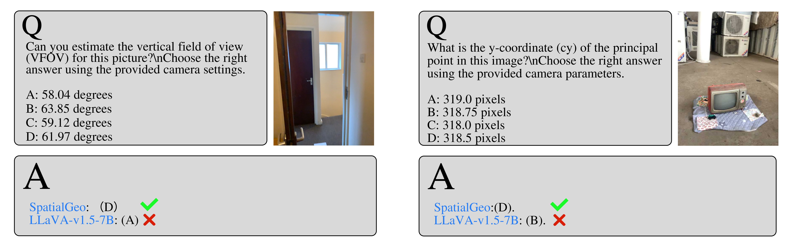

  

# SpatialGeo: Boosting Spatial Reasoning in Multimodal LLMs via Geometry-Semantics Fusion
______________________________________________________________________

***SpatialGeo*** enhances ***spatial reasoning*** in MLLMs based on the novel vision encoder generating spatial-aware visual embedding.

The overall architecture of ***SpatialGeo*** is shown in the figure below, which is composed of three major modules: 1) ***CLIP module*** with the CLIP encoder and its adapter to extract instance-level semantic features; 2) ***MoGe module*** with the MoGe encoder and its adapter to embed a mixture of geometry and semantic features; 3) ***LLM module*** with interleaved geometry and semantic embeddings together with text tokens as inputs to generate question answering.

  

   <!-- 增加一个空行 -->
______________________________________________________________________

## Spatial VQA Datasets
We compare SpatialGeo with SOTA MLLMs on spatial VQA datasets, including ***SpatialRGPT-Bench*** and ***SpatialScore***.

### Examples From SpatialRGPT-Bench
We select different types of questions from ***SpatialRGPT-Bench*** for presentation.

  <strong>Fig.1 Vertical Distance</strong> 
  

   

   <!-- 增加一个空行 -->

  <strong>Fig.2 Width Data</strong> 
  

    

   <!-- 增加一个空行 -->

  <strong>Fig.3 Height Data</strong> 
  

   <!-- 增加一个空行 -->
______________________________________________________________________

### Examples From SpatialScore
We select different types of questions from ***SpatialScore*** for presentation.

  <strong>Fig.1 Boundingboxs Distance</strong> 
  

   

   <!-- 增加一个空行 -->

  <strong>Fig.2 Objects Distance</strong> 
  

    

   <!-- 增加一个空行 -->

  <strong>Fig.3 Objects Distance</strong> 
  

    

   <!-- 增加一个空行 -->

  <strong>Fig.4 Object Localization</strong> 
  

   <!-- 增加一个空行 -->

  <strong>Fig.5 Camera and Image Transformation</strong> 
  

   <!-- 增加一个空行 -->
______________________________________________________________________

### Examples of Real World Photography
We take some photos in the real world for testing.

  <strong>Fig.6 Real World Photography</strong> 
  

