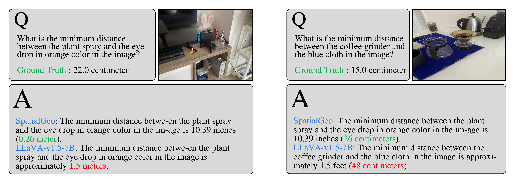

<p align="center">
  
</p>

# SpatialGeo: Boosting Spatial Reasoning in Multimodal LLMs via Geometry-Semantics Fusion
______________________________________________________________________

***SpatialGeo*** enhances ***spatial reasoning*** in MLLMs based on the novel vision encoder generating spatial-aware visual embedding.

The overall architecture of ***SpatialGeo*** is shown in the figure below, which is composed of three major modules: 1) ***CLIP module*** with the CLIP encoder and its adapter to extract instance-level semantic features; 2) ***MoGe module*** with the MoGe encoder and its adapter to embed a mixture of geometry and semantic features; 3) ***LLM module*** with interleaved geometry and semantic embeddings together with text tokens as inputs to generate question answering.

<p align="center">
  
</p>
<br>  <!-- 增加一个空行 -->

______________________________________________________________________

## Spatial VQA Datasets
We compare SpatialGeo with SOTA MLLMs, i.e., ***LLaVA-v1.5-7B*** [1], ***GPT-4.1*** [2], ***SpatialRGPT*** [3] on spatial VQA datasets, including ***SpatialRGPT-Bench*** [3] and ***SpatialScore*** [4]

______________________________________________________________________

### Examples From SpatialRGPT-Bench
We select different types of questions from ***SpatialRGPT-Bench*** for demonstration.
<p align="center">
  <strong>Fig.1 Vertical Distance</strong><br>
  
</p>   

<br>  <!-- 增加一个空行 -->

<p align="center">
  <strong>Fig.2 Width Data</strong><br>
  
</p>    

<br>  <!-- 增加一个空行 -->

<p align="center">
  <strong>Fig.3 Height Data</strong><br>
  
</p>
<br>  <!-- 增加一个空行 -->

______________________________________________________________________

### Examples From SpatialScore
We select different types of questions from ***SpatialScore*** for presentation.
<p align="center">
  <strong>Fig.4 Boundingboxs Distance</strong><br>
  
</p>   

<br>  <!-- 增加一个空行 -->

<p align="center">
  <strong>Fig.5 Objects Distance</strong><br>
  
</p>    

<br>  <!-- 增加一个空行 -->

<p align="center">
  <strong>Fig.6 Objects Distance</strong><br>
  
</p>    

<br>  <!-- 增加一个空行 -->

<p align="center">
  <strong>Fig.7 Object Localization</strong><br>
  
</p>
<br>  <!-- 增加一个空行 -->

<p align="center">
  <strong>Fig.8 Camera and Image Transformation</strong><br>
  
</p>

<br>  <!-- 增加一个空行 -->
______________________________________________________________________

### Examples of Real World Photography
We take some photos in the real world for testing.
<p align="center">
  <strong>Fig.9 Real World Photography</strong><br>
  
</p>
<br>  <!-- 增加一个空行 -->

______________________________________________________________________

## Install
Run LLaVA on Linux.
1. Clone this repository and navigate to LLaVA folder
```bash
git clone https://github.com/Ricky-PLUS/SpatialGeo.git
cd SpatialGeo/SpatialGeo
```

2. Install Package
```Shell
conda create -n mogellava python=3.10 -y
conda activate mogellava
pip install --upgrade pip 
pip install -e .
```

3. Install additional packages for training cases
```
pip install -e ".[train]"
pip install flash-attn --no-build-isolation
```

## Train
SpatialGeo training consists of two stages: (1) feature alignment stage; (2) visual instruction tuning stage. SpatialGeo is trained on 8 A800 GPUs with 80GB memory.

### Stage-1
The training script is SpatialGeo/scripts/v1_5/pretrainmoge.sh
Download annotations and images from the following link (https://huggingface.co/datasets/liuhaotian/LLaVA-Pretrain/tree/main).

### Stage-2
The training script is SpatialGeo/scripts/v1_5/finetunemoge.sh
Please download the annotation of the final mixture our instruction tuning data [llava_v1_5_mix665k.json](https://huggingface.co/datasets/Ricky159/SpatialGeo), and download the images from constituting datasets:

- COCO: [train2017](http://images.cocodataset.org/zips/train2017.zip)
- VisualGenome: [part1](https://cs.stanford.edu/people/rak248/VG_100K_2/images.zip)
- Please download the original image from [OpenImagesV4] (https://storage.googleapis.com/openimages/web/download_v4.html) based on llava_v1_5_mix665k.json.

## Inferencing
Run the following command to inference a single image:
```Shell
python -m llava.serve.cli \
    --model-path "your_model_path" \
    --image-file "image_path" \
    --load-4bit
```

## Evaluation

You can find some evaluation benchmark tests in the SpatialGeo/llava/eval folder.
Most of the testing processes are consistent with LLaVA1.5

### Reference

[1] Haotian Liu, Chunyuan Li, Yuheng Li, and Yong Jae Lee. "Improved baselines with visual instruction tuning." CVPR, pp. 26296-26306. 2024.​

[2] OpenAI. "Introducing gpt-4.1 in the API." April 2025. [Online]. Available: https://openai.com/index/gpt-4-1/ 

[3] An-Chieh Cheng, Hongxu Yin, Yang Fu, Qiushan Guo, Ruihan Yang, Jan Kautz, Xiaolong Wang, and Sifei Liu. "SpatialRGPT: Grounded Spatial Reasoning in Vision-Language Models." NeurIPS, pp.135062-135093. 2025.

[4] Haoning Wu, Xiao Huang, Yaohui Chen, Ya Zhang, Yanfeng Wang, and Weidi Xie. "SpatialScore: Towards Unified Evaluation for Multimodal Spatial Understanding." arXiv preprint arXiv:2505.17012  2025.​

## Related Projects

- [LLaVA 1.5](https://github.com/haotian-liu/LLaVA)
